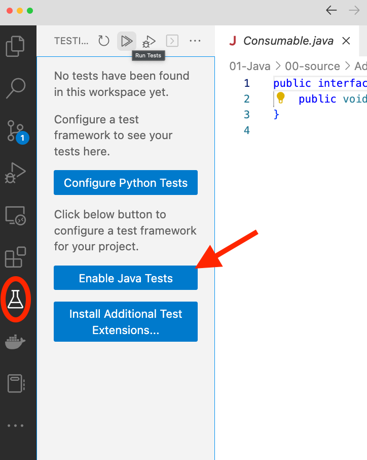

# CMPS 1600 Project 01

In this project, you will complete the text-based adventure game we started in class.

Deadlines:

- Milestone 1: **Monday March 6th**
- Milestone 2: **Wednesday March 15th** 
- Milestone 3: **Wendesday March 22nd**

# Milestone 1: Documentation and Testing

For Milestone 1, you will add documentation and unit tests for the existing classes of this projects.

Requirements:

1) UML Diagram containing all classes.
2) Javadoc comments for classes and all non private methods of all classes.
3) Unit Tests for the `Character` class and `HealingPotion` class.

## UML Diagrams

Create a UML Diagram containing all classes in this project. You may create the however you like, but add your final file(s) in PDF format to a `uml` directory in the root directory of your project.

## Javadoc Comments

Add Javadoc comments to all classes. Each class should have a javadoc comment at the top of the class. All non-private methods should have javadoc comments.

To serve as an example, javadoc comments have been provided for the `Consumable` interface (more on this below) and for the Character's `setTempDamageBuff` method.

Compile your javadoc comments into a javadoc website in a `docs` directory in the root directory of your project.

To do so, on the terminal, located in your project's root directory, issue the following command:

`javadoc -link https://docs.oracle.com/en/java/javase/19/docs/api -sourcepath ./src/ adventure_game adventure_game.items -d ./docs`

## Unit Tests

Add Unit Tests for the `Character` and `HealingPotion` classes. All methods more complicated than trivial getters should be tested.

The best way to write unit tests for Java is to use JUnit.

VS Code makes it easy to get setup with JUnit and to run JUnit Tests. The VS Code Extension "Extension Pack for Java" bundles JUnit Testing into VS Code for you. 

To start writing and running JUnit tests, you need to enable java tests. First, in VS Code, open any java source file to force VS Code to "open java projects" and enable java extensions. Then you will have a test beaker Testing option in your left menu. From there, click on "Enable Java Tests"

VS Code will download the required library and you're good to go.

Here is the documentation on [Writing JUnit Tests](https://junit.org/junit5/docs/current/user-guide/#writing-tests). 

Also provided to help you get you started is the beginning of a test suite `CharacterTests` for the class `Character`.

Open up `CharacterTests`.

You see that there is a `@BeforeEach` annotation above the `setup()` method. `setup()` will be run before each test.

Every method labelled with the `@Test` annotation (so far just `testModifyHealth`) is a test method.

1. Add test methods for all methods except for trivial getters 

2. Also implement the `HealingPotionTests` class that is provided for you in the items package.

As you add new classes and features to your project, add tests for them as well.

# Milestone 2: Character Creation

Implement character creation. When the game starts, allow the user to create their own character.

Through a series of messages and prompts, have the user to enter a name for their character and then allow them to spend stat points to buy health, damage points, and mana.

The user will be given 20 stat points to spend. Example point values could be:
- 1 stat point gives +10 health
- 1 stat point gives +1 to their base damage
- 1 stat point gives +3 mana

After they have spent all their points, create their character and let them start playing.

### Mana

Mana is an addition beyond what we did in class. Mana allows a Character to cast a spell.

Add two new options to the Player's take turn menu:
- Cast a spell
- Charge up mana

Casting a spell costs 3 mana and reduces the opponent's health by half.

Charging up mana increments the Player's mana by 1.

> Feel free to modify these magical mechanics.

### Items

Also included in the game are items. A `Consumable` interface is provided. It allows you to create subclasses that are consumable. Each `Consumable` must implement the `consume` method which manifests whatever effect the consumable object has. One example item is provided for you, the `HealingPotion`.

Add atleast one additional `Consumable` item.

## Documentation and Testing

As you add new methods and classes to this project, document and test them. In fact, it is best to do this first! Write javadoc comments for method stubs, write tests for them, then implement the methods. 

# Milestone 3: Exploration

Add exploration to your game! Allow the player to explore a series of connected rooms, looking for a portkey. If they encounter any NPCs, they must fight them. If they find the portkey, they win.

## Representing the Layout

Each room will be an object with references to 4 other rooms, representing potential exits in each of the cardinal directions: East, North, West, South. Rooms may not have exits in all directions, in which case, all directions which are not an exit are `null`. A room may also contain an NPC to fight and 0 or more objects.

Create a `Room` class with the following attributes:
- `Room east`
- `Room north`
- `Room west`
- `Room south`
- `NPC opponent`
- `ArrayList<Consumable> items`

Add methods as you see fit.

> If there is an opponent in a room, that opponent must be defeated before any items can be obtained.

## Reading in the layout from file

You will read in a map (could be a dungeon, mansion, hospital, cave system, etc..) containing the layout of the rooms from a file. The format of the file is as follows:

- Any lines that begin with a `#` are comments and should be ignored when the file is read in.

- The first non-comment line of the file is the number $n$, the number of rooms in the mansion.

- The next $n$ lines contain three values separated by colons `':'` 
    1. a room identifier given as an int
    2. the room name
    3. then a description for that room.

- All non-comment lines after that give the connections between the rooms. Each of these lines contain ints separated by colons. The first int is a room ID, the next four values are the IDs of the rooms through its exits. The exits are given by cardinal direction in the order of East, North, West, then South. Any direction which does not have an exit is given a value of -1.

> You can split a String on colons using `str.split(":")` You can strip all leading and trailing whitespace using `str.strip()`.

An example input file is provided for you: `data/levels/the-stilts.txt`

Before running your game on this map, draw it out by hand so that you can refer your map to verify that your game behaves as expected. 

Create atleast one map of your own design. It may also be easiest to create atleast one very simple map for testing and debugging purposes.

## Implementing Exploration

The player will always start in room 0. Randomly assign NPCs and items to the other rooms. 

For every turn of the game, the player is presented with a description of the room they are in along with where its exits are. The player then chooses which exit to go through to enter a new room. If the player enters a room with an opponent in it, before anything else happens, they enter combat with that opponent. If they defeat the opponent, they get any items present in the room. If the room contains the portkey, they win.

If at any point, the player is defeated by an opponent, they lose. The player's stats are persistent between combats. That is, however much health and mana they had at the end of the last combat will be how much they start with for the next one.

## Documentation and Testing

As always, add documentation and unit tests for the classes and methods that you create.

# Customization

Feel free to customize the mechanics and change the context to write the game that you want to create! You may add classes, methods, or features to this game as you see fit. Document any custom features and modifications that you make in the `README.md` in the root directory of this project.

# Bonus

**Opportunity 1 (10 pts)**

Add experience points and leveling up to the game! When a player levels up, boost their health and mana back up to max and allow them to spend more stat points to increase their stats!

**Opportunity 2 (10 pts)**

Add multiple levels (e.g, dungeons to explore) to the game. Once a player wins one level, they move on to the next until they lose or beat your game. Boss Battle? You may share your maps with each other. Add your name to the top of any maps that you create. While you may share maps, each of your game implementations must be individual and independently produced.

Document any bonus features you implement in `README.md` in the root project directory.

# Acknowledgements

Thank you to Ted Holmberg for inspiration, ideas, and mechanics which have ended up in this project.